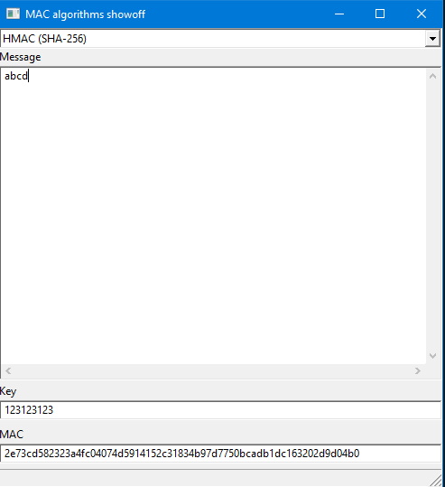
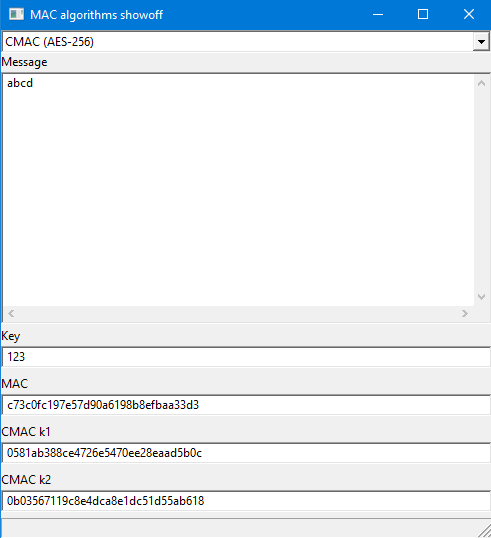

# Lucrearea de laborator Nr.1 la Protocoale Criptografice

Tema: **HMAC, CMAC**.

A elaborat: *Curmanschii Anton, IA1901*.

Vedeți [Github](https://github.com/AntonC9018/uni_cryptoprotocols). 

## Sarcina

Să se realizeze o interfață grafică ce ar permite calcularea lor Message Authentication Code (MAC), utilizând 2 algoritme:
- HMAC, MAC-uri băzate pe funcții hash (SHA-256);
- CMAC, MAC-uri băzate pe cifruri bloc simetrice (AES-256).


## HMAC

HMAC este foarte ușor de realizat. L-am realizat după [definiția de pe wiki](https://www.wikiwand.com/en/HMAC#/Definition).
[Vectorul test](https://www.wikiwand.com/en/HMAC#/Examples) l-am luat tot de pe wiki.

### Codul

Unica explicare la cod este că `hashFunction` este funcția ce realizează hash-area.
Este un parametru șablon. 
În blocul `unittest` puteți vedea că îi dau valoarea `sha256Of` care este funcția, prezentă în librăria standartă D.

```d
auto calculateHMAC(alias hashFunction, int blockSize)(const(ubyte)[] key, const(ubyte)[] message)
{
    // The hash function returns a static array so it needs to be 
    // stack allocated outside the if scope.
    typeof(hashFunction(key)) hashTemporary = void;

    if (key.length > blockSize)
    {
        hashTemporary = hashFunction(key);
        key = hashTemporary[];
    }
    key.length = blockSize;
    
    ubyte[blockSize] outerPad = void;
    outerPad[] = key[] ^ 0x5c;
    ubyte[blockSize] innerPad = void;
    innerPad[] = key[] ^ 0x36;

    return hashFunction(outerPad ~ hashFunction(innerPad ~ message));
}
unittest
{
    auto key = representation("key");
    auto message = representation("The quick brown fox jumps over the lazy dog");
    auto hmac = calculateHMAC!(sha256Of, 64)(key, message);
    assert(hmac.toHexString!(LetterCase.lower) == "f7bc83f430538424b13298e6aa6fb143ef4d59a14946175997479dbc2d1a3cd8");
}
```

### Interfața

În interfața de fapt se face tot aceeași când se schimbă valoarea la textbox-uri.




## CMAC

CMAC este un pic mai dificil, însă codul trebuie să fie clar și ușor de înțeles.


### Codul

L-am realizat cu un șablon, ceea ce semnifică că în principiu poate lucra cu orice cifru bloc.
Deci, implementarea mea deleghează inițializarea cifrului la utilizator.

Implementarea este un pic mai complicată decât HMAC, voi arăta aici doar unele momente.

În primul rând, are loc inițializarea celor două chei [după algoritm](https://datatracker.ietf.org/doc/html/rfc4493#section-2.3).
`blockCipher` este funcția ce execută criptarea bloc la un bufer dat. 
Se consideră că starea cheii de criptare a fost deja inițializată de utilizator.

```d
struct KeyCMAC(int blockSize)
{
    ubyte[blockSize] k1;
    ubyte[blockSize] k2;
}

auto getKey()
{
	static if (blockSize == 8)
		enum ubyte c = 0x1b;
	else static if (blockSize == 16)
		enum ubyte c = 0x87;
	else static assert(0, "The size of the block cipher must be 8 or 16");

	ubyte[blockSize] zeros = 0;
	auto k0 = blockCipher(zeros);

	ubyte[blockSize] k1 = void;
	shiftLeftInto(k0[], k1[]);
	if (k0[0] & 0x80)
		k1[15] ^= c;

	ubyte[blockSize] k2 = void;
	shiftLeftInto(k1[], k2[]);
	if (k1[0] & 0x80)
		k2[15] ^= c;

	return KeyCMAC!blockSize(k1, k2);
}
```

Al doilea pas este [calcularea MAC-ului (a tag-ului)](https://datatracker.ietf.org/doc/html/rfc4493#section-2.4).
Ultimul bloc este tratat diferit în dependența de lungimea mesajui.

```d
auto getTag(ref const(KeyCMAC!blockSize) key, const(ubyte)[] message)
{
    ubyte[blockSize] mLast = void;
    auto numIters = message.length / blockSize;

    // complete block
    if (message.length > 0 && message.length % blockSize == 0)
    {
        mLast[] = key.k1[] ^ message[($ - blockSize) .. $];
        numIters--;
    }
    // incomplete block
    else
    {
        auto byteCount = message.length % blockSize;
        mLast[0..byteCount]         = key.k2[0..byteCount] ^ message[($ - byteCount) .. $];
        mLast[byteCount]            = key.k2[byteCount] ^ 0x80;
        mLast[(byteCount + 1) .. $] = key.k2[(byteCount + 1) .. $];
    }
    
    size_t messageIndex = 0;
    ubyte[blockSize] x = 0;

    foreach (i; 0..numIters)
    {
        x[] ^= message[messageIndex .. (messageIndex + blockSize)];
        x = blockCipher(x);
        messageIndex += blockSize;
    }

    x[] ^= mLast[];
    return blockCipher(x);
}
```

Vectorii test le-am luat [din același document](https://datatracker.ietf.org/doc/html/rfc4493#section-4).

```d
alias AesCMAC = CMAC!doAes;
auto processedKey = AesCMAC.getKey();
assert(processedKey.k1.toHexString!(LetterCase.lower) == "fbeed618357133667c85e08f7236a8de");
assert(processedKey.k2.toHexString!(LetterCase.lower) == "f7ddac306ae266ccf90bc11ee46d513b");

ubyte[inputSize] tag;

tag = AesCMAC.getTag(processedKey, []);
assert(equal(tag[], fromHexString("bb1d6929e95937287fa37d129b756746")));

tag = AesCMAC.getTag(processedKey, fromHexString("6bc1bee22e409f96e93d7e117393172a").array);
assert(equal(tag[], fromHexString("070a16b46b4d4144f79bdd9dd04a287c")));

tag = AesCMAC.getTag(processedKey, 
    fromHexString("6bc1bee22e409f96e93d7e117393172aae2d8a571e03ac9c9eb76fac45af8e5130c81c46a35ce411").array);
assert(equal(tag[], fromHexString("dfa66747de9ae63030ca32611497c827")));
```

Implementarea la AES am luat inițial de pe [aici](https://gist.github.com/vladimirgamalyan/959754248985a62ba7bf7af848f1aaaf), dar am mai modificat unele lucruri ca să fie mai ușor de utilizat în D (folosirea de yes/no flaguri, returnarea directă, dar nu prin pointer, detectarea modulului de criptare/decriptare asociat contextului AES automat).

Funcția de verificare nu am folosit-o, deoarece aceasta implică aplicarea trivială a aceluiași algoritm și verificarea dacă MAC-urile sunt identice (nu merită).

### Interfața

Interfața arată cheile intermediare $ k_1 $ și $ k_2 $.
Încă un moment: CMAC necesită o cheie de lungime particulară (folosesc AES-256, deci 32 caractere). 
Dacă specificați o cheie mai scurtă, restul biților este umplut cu 0.




## Remarci

Interfețele le-am realizat cu ajutorul [librăriilor lui Adam D. Ruppe](https://github.com/adamdruppe/arsd).
Am folosit librăria [minigui](https://github.com/adamdruppe/arsd/blob/master/minigui.d).
Ele sunt minimale, necesetând 1-2 fișiere sursă și nici o instalare, la distribuirea n-am nevoie să împlachetez programul împreună cu librării dinamice, etc.

Am început implementarea la UMAC, vedeți codul [aici](https://github.com/AntonC9018/uni_cryptoprotocols/blob/70c5fc3dcb418b3da2ecb6692cc93653ba4e6c98/source/umac_scrapped.d).

## Întregul cod

Vedeți întregul cod în [acest fișier](https://github.com/AntonC9018/uni_cryptoprotocols/blob/70c5fc3dcb418b3da2ecb6692cc93653ba4e6c98/source/app.d).