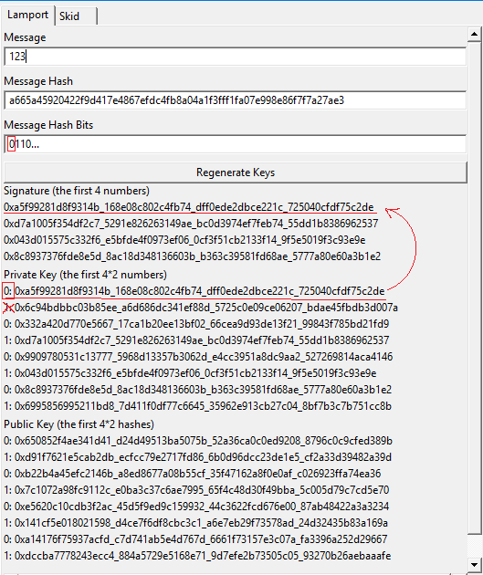
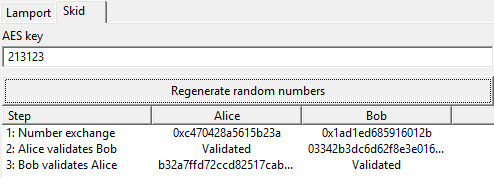

# Lucrearea de laborator Nr.2 la Protocoale Criptografice

Tema: **Lamport, SKID-3**.

A elaborat: *Curmanschii Anton, IA1901*.

Vedeți [Github](https://github.com/AntonC9018/uni_cryptoprotocols). 


## Sarcina

Să se realizeze o interfață grafică ce ar ilustra modul de funcționare a următoarelor scheme criptografice:
- Lamport (drept funcția hash am folosit SHA-256);
- SKID-3 (drept cifrul bloc am folosit AES-128 și drept funcția hash am folosit MD5).


## Lamport

### Introducere

Lamport este o schemă de autentificare, băzată pe o funcție hash și un set de numere generate aleator.
Este considerat că această schemă este rezistentă la atacuri cu computeri cuantumi.

[Wiki](https://www.wikiwand.com/en/Lamport_signature).

### Algoritmul de bază

[Wiki](https://www.wikiwand.com/en/Lamport_signature#/Example).

1. Partea ce dorește să fie autentificată, generează 2 tablouri de căte 256 de numere aleatorii, unde fiecare număr este pe 256 de biți. Aceste tablouri constituie cheia secretă.

2. Aceste numere din cheia secretă sunt luate printr-o funcție hash unidirecțională cu output-ul pe 256 de biți. 
   Prin urmare, se obțin 2 tablouri cu aceleași dimensiuni. Constituie cheia secretă care poate fi partajată cu destinătarul mesajului în mod public.

3. Pentru a genera codul de autentificare pentru un mesaj dat:
        
     - Mesajul este luat prin funcția hash. Rezultatul este un șir pe 256 biți.
     - Pentru fiecare bit din mesaj, se ia numărul aleator din cheia secretă, locuit în tabloul cu indicele egal cu valoarea bitului (primul tablou, dacă bitul nu este setat, al doilea tablou, dacă bitul este setat).
     - Aceste numere luate din cheia secretă reprezintă semnatura digitală.

4. După generarea unei semnaturi digitale în așa mod, cheia secretă nu mai poate fi utilizată din nou, și trebuie să fie regenerată.

5. Destinătarul poate să verifice semnatura, selectând numerele după biții hash-ului mesajului, însă din cheia publică cunoscută, cum am descris la pasul 3, pe urmă verificând dacă hash-ul fiecărui număr din semnatură este egal cu numărul extras din cheia publică corespunzător.


### Arborele lui Merkle

Algoritmul poate fi modificat să conțină cheia publică mai mică și să fie posibil de semnat mai multe mesaje deodată.
Ideea este de folosit arbori lui Merkle (arbori hash) pentru a defini o modalitate de verificare a multiplelor mesaje.

[Wiki](https://www.wikiwand.com/en/Merkle_signature_scheme).

1. Se generează $ 2^N $ perechi cheia secretă - cheia publică, căte o pereche pentru fiecare mesaj ce urmează a fi semnat.
   În cadrul acestului algoritm, cheile publice nu sunt partajate.

2. Se construiește un arbore lui Merkle asupra hash-urilor cheilor publice. 
   
   - Se aplică funcția hash la cheia fiecare publică $ i $, rezultatele fiind nodurile primului nivel de arbore.
   - Valorile nodului $ i $ a următorului nivel se obțin prin aplicarea funcției hash la rezultatul concatenării valorilor nodurilor $ 2 i $ și $ 2 i + 1 $ a precedentului nivel. 
     Deci, dacă notăm valoarea nodului pe poziția $ i $ la nivelul $ j $ ca $ { val } ^ { j } _ { i } $, atunci 
     $ { val } ^ { j + 1 } _ { i } := hash({ val } ^ { j } _ { 2 i } || { val } ^ { j } _ { 2 i + 1 }) $.
   - Arborele este construit, când se ajunge la singurul ultimul nod. (De fapt avem un arbore binar cu susul în jos). 

3. Cheia publică este definită ca valoarea ultimului nod.

4. Pentru a semna un mesaj dat, se folosesc pașii din punctul 3 al algoritmului de bază. 
   Semnatura rezultată după executarea acelor pași o numim $ {signature}_i $.
   Semnatura finală este definită astfel: $ {signature} _ i ^ \prime := {signature} _ i || { publicKey } _ i || { auths } _ i $.
   $ {auths} _ i $ sunt noduri intermediare necesare pentru a ajunge la ultimul nod din arborele lui Merkle (a se vede [wiki](https://www.wikiwand.com/en/Merkle_signature_scheme#/Signature_generation) pentru un exemplu).

5. Destinătarul verifică semnatura prin hash-area cheii publice $ { publicKey } _ i $ din $ {signature} _ i ^ \prime $, 
   după ce trece prin toate $ { auth } _ j $ din tabloul $ { auths } _ i $, calculând 
   $ { currentHash _ {j + 1} } := hash({ currentHash _ j } || { auth } _ j) $ (sau $ hash({ auth } _ j || { currentHash _ j }) $, depinde de $ i $), unde
   $ { currentHash } _ 0 := hash({publicKey} _ i) $.
   După ce s-au calculat toate hash-urile, se verifică dacă ultimul $ { currentHash } $ este egal cu valoarea ultimului nod.

Nu includ codul pentru această parte a algoritmului, dar îl vedeți [aici](https://github.com/AntonC9018/uni_cryptoprotocols/blob/52fcdb889f1fbfeb68d00197e69e869bbbbd643b/source/lab2/lamport.d#L68-L302).  


### Realizarea

Codul este scurt și foarte simplu, îmi pare că nu necesită nici o explicare aici.

```d
alias LamportKey = ulong[4][2][256];
alias LamportSignature = ulong[4][256];

LamportKey generateLamportPrivateKey()
{
    LamportKey result;
    foreach (ref ulong value; cast(ulong[]) result[])
        value = uniform!ulong;
    return result;
}

template Lamport(alias hashFunction)
{
    alias generatePrivateKey = generateLamportPrivateKey;

    LamportKey generatePublicKey(in LamportKey privateKey)
    {
        LamportKey result;
        foreach (index, value; cast(const ulong[4][]) privateKey)
            (cast(ulong[4][]) result)[index] = cast(ulong[4]) hashFunction(cast(ubyte[]) value[]);
        return result;
    }

    LamportSignature generateSignature(const ubyte[] message, in LamportKey key)
    {
        auto messageHash = cast(ulong[4]) hashFunction(message);

        LamportSignature result;

        foreach (byteIndex; 0..4)
        foreach (bitIndex; 0..64)
        {
            size_t index = byteIndex * 64 + bitIndex;
            result[index] = key[index][(messageHash[byteIndex] >> bitIndex) & 1];
        }

        return result;
    }

    bool validateSignature(const ubyte[] message, in LamportSignature signature, in LamportKey publicKey)
    {
        auto messageHash = cast(ulong[4]) hashFunction(message);

        foreach (byteIndex; 0..4)
        foreach (bitIndex; 0..64)
        {
            size_t index = byteIndex * 64 + bitIndex;
            auto hash = cast(ulong[4]) hashFunction(cast(ubyte[]) signature[index]);
            if (hash != publicKey[index][(messageHash[byteIndex] >> bitIndex) & 1])
                return false;
        }
        return true;
    }
}
```

Și un test care arată utilizarea funcțiilor:

```d
unittest
{
    alias Lamp = Lamport!sha256Of;
    auto privateKey = Lamp.generatePrivateKey();
    auto publicKey = Lamp.generatePublicKey(privateKey);
    auto signature = Lamp.generateSignature([1, 2, 3], privateKey);
    assert(Lamp.validateSignature([1, 2, 3], signature, publicKey));
    auto signature2 = Lamp.generateSignature([3, 2, 1], privateKey);
    assert(signature != signature2);
}
```

### Interfața

Deoarece nu pot arăta toate numerele cheii secrete sau publice deoadată pe ecran (ia prea mult spațiu), am decis să arăt pe ecran doar primele $ N $ numere (respectiv și primele N biți ai cheii).

Deci, text boxa *Message Hash Bits* arată primii $ N $ biți ai hash-ului mesajului.
Dacă avem pe poziția $ i $ este $ 0 $, atunci luăm al $ i $-lea număr prefixat cu $ 0 $, din lista cu numerele din cheia secretă.




## SKID-3

### Introducere

SKID-3 este un protocol ce permite autentificarea reciprocă între două părți, ce folosește funcții hash și criptarea cu cheie simetrică, inițial cunoscută de ambele părți.

[Sursa](https://people.cs.rutgers.edu/~pxk/rutgers/notes/content/13-crypto.pdf#page=10&zoom=auto,-151,380)

### Procesul de autentificare

Alice și Bob vreau să se autentifice reciproc. 
Presupunem, că inițial Alice îl va autentifica pe Bob.

1. Sunt generate câte un număr aleator de Alice și de Bob $ n_{a}, n_{b} $. 
   Ele sunt partajate între ambele părți (public? securizat? nu am putut găsi informații la aceasta).

2. Bob calculează valoarea $ h_0 := hash(n_a, n_b, ''Bob'') $, o criptează cu ajutorul cifrului bloc, și o transmite la Alice.

3. Alice tot calculează $ h_0 $, o criptează cu cifrul bloc, și o verifică cu valoarea primită de la Bob.
   Faptul că valorile au fost egale, semnifică că Bob dispune de cheia secretă a cifrului bloc, și deci este de fapt Bob.

4. Alice calculează $ h _ 1 = hash(n_b, ''Alice'') $, o criptează și o trimite lui Bob. 
   Bob tot poate calcula $ h_1 $, o cripta, și iarăși poate compara valorile. 
   Dacă valorile sunt identice, el poate fi sigur că Alice dispune de cheia secretă, deci este de fapt Alice.

### Realizarea

În cod, funcțiile cu sufixul *A* corespund pasului unde Alice validează identitatea lui Bob, iar *B* invers.

`TDigest` poate fi orice algoritm de calculare a valorii hash, 
iar `TEncryptionBlockCipher` poate fi orice cifru bloc. 
Principalul este ca mărimile lor să fie compatibile, ceea ce se verifică pe linia cu `static assert(__traits(compiles ...`.

Restul este direct după explicările de mai sus.

```d
struct SKID(TDigest, TEncryptionBlockCipher)
{
    TDigest _digest;
    TEncryptionBlockCipher _blockCipher;
    /// Step 1: generate a random number
    /// I don't know if this needs to be encrypted?
    ulong _ownRandomNumber;
    const(ubyte)[] _ownName;

    static assert(__traits(compiles, _blockCipher.encrypt(_digest.finish())), 
        "The block sizes of the hash and the block cipher need to match");

    void resetRandomNumber(ulong number)
    {
        _ownRandomNumber = number;
    }

    auto encryptHash() { return _blockCipher.encrypt(_digest.finish()); }
    
    /// Step 2: create authentication hash.
    auto computeHashA(ulong receivedRandomNumber)
    {
        _digest.put(receivedRandomNumber.bytes);
        _digest.put(_ownRandomNumber.bytes);
        _digest.put(_ownName);
        return encryptHash();
    }

    /// Step 3: check authentication hash.
    bool validateHashA(typeof(_digest.finish()) encryptedHash, ulong receivedRandomNumber, const ubyte[] expectedName)
    {
        _digest.put(_ownRandomNumber.bytes);
        _digest.put(receivedRandomNumber.bytes);
        _digest.put(expectedName);
        return encryptedHash == encryptHash();
    }

    /// Step 4: compute hash of the random number and own identity.
    auto computeHashB(ulong receivedRandomNumber)
    {
        _digest.put(receivedRandomNumber.bytes);
        _digest.put(_ownName);
        return encryptHash();
    }

    /// Step 5: validate hash of the other party.
    bool validateHashB(typeof(_digest.finish()) encryptedHash, const ubyte[] expectedName)
    {
        _digest.put(_ownRandomNumber.bytes);
        _digest.put(expectedName);
        return encryptedHash == encryptHash();
    }
}

auto skid(TDigest, TEncryptionBlockCipher)(TDigest digest, TEncryptionBlockCipher cipher, string name)
{
    return SKID!(TDigest, TEncryptionBlockCipher)(digest, cipher, 0, name.representation);
}
```

Și un unit test, care poate considerat drept exemplu de utilizare:
```d
struct AESWrapper
{
	AESContext!(Yes.encrypt) encryptionContext;
	auto encrypt(in ubyte[16] bytes) { return cryptEcb(encryptionContext, bytes); }
}
unittest
{
    const(ubyte)[16] key = "1234567890asdfgh".representation.dup;
    
    auto Alice = skid(MD5(), AESWrapper(createEncryptionContext(key)), "Alice");
    auto Bob   = skid(MD5(), AESWrapper(createEncryptionContext(key)), "Bob");

    auto alicesRandomNumber = uniform!ulong;
    Alice.resetRandomNumber(alicesRandomNumber);
    
    auto bobsRandomNumber = uniform!ulong;
    Bob.resetRandomNumber(bobsRandomNumber);

    // Both parties receive each other's random numbers
    // Alice will validate Bob's identity first.
    auto hash1 = Bob.computeHashA(alicesRandomNumber);
    assert(Alice.validateHashA(hash1, bobsRandomNumber, "Bob".representation));

    auto hash2 = Alice.computeHashB(bobsRandomNumber);
    assert(Bob.validateHashB(hash2, "Alice".representation));
}
```

### Interfața

Aici nu am avut multe idei cum să organizez interfața, deci am făcut ceva foarte simplu.
Avem posibilitatea de a introduce cheia secretă pentru criptarea cu AES, de a regenera numerele aleatorii, și atât.

Tabela arată cum a trecut fiecare pas.

1. Numerele generate aleator.

2. Hash-ul $ h_0 $ calculat de Bob și rezultatul validării lui Alice.

3. Hash-ul $ h_1 $ calculat de Alice și rezultatul validării lui Bob.

